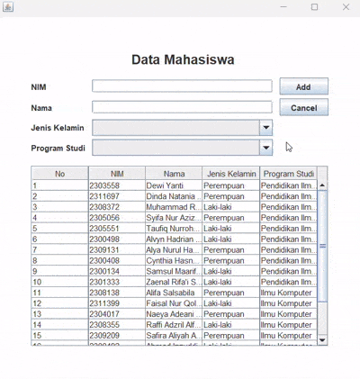

# Janji
Saya Nuansa Bening Aura Jelita dengan NIM 2301410 mengerjakan Tugas Praktikum 4 dalam mata kuliah Desain dan Pemrograman Berorientasi Objek untuk keberkahanNya maka saya tidak melakukan kecurangan seperti yang telah dispesifikasikan. Aamiin.

# Desain Program

Program dirancang untuk mengelola data mahasiswa dengan antarmuka grafis (GUI) menggunakan Java Swing. 
Program ini memungkinkan pengguna untuk melihat, menambah, memperbarui, dan menghapus data mahasiswa dengan mudah.

Program ini terdiri dari 2 kelas utama:

1. **Mahasiswa** (Model Data)
   * Atribut: 
     - `nim` (Nomor Induk Mahasiswa)
     - `nama` (Nama Mahasiswa)
     - `jenisKelamin` (Jenis Kelamin Mahasiswa)
     - `prodi` (Program Studi Mahasiswa)
   * Metode:
     - Constructor untuk inisialisasi objek
     - Getter & Setter untuk setiap atribut

2. **Menu** (Antarmuka Pengguna)
   * Mewarisi kelas `JFrame`
   * Komponen UI:
     - `JPanel` sebagai panel utama
     - `JTextField` untuk input nim dan nama
     - `JComboBox` untuk pemilihan jenis kelamin dan program studi
     - `JTable` untuk menampilkan data
     - `JButton` untuk aksi Add/Update, Cancel, dan Delete
     - `JLabel` untuk judul dan label form

# Alur Program

1. **Mulai**
   * Program membuat jendela aplikasi dan menampilkan data awal mahasiswa dalam tabel
   * Data awal sudah diisi dengan 20 data mahasiswa

2. **Menambah Data**
   * Isi form dengan data mahasiswa baru
   * Tekan tombol "Add"
   * Data akan ditambahkan ke tabel dan form dibersihkan

3. **Mengubah Data**
   * Klik data di tabel yang ingin diubah
   * Form akan terisi otomatis dengan data yang dipilih
   * Ubah data sesuai keinginan
   * Tekan tombol "Update"
   * Data di tabel akan diperbarui

4. **Menghapus Data**
   * Klik data di tabel yang ingin dihapus
   * Tekan tombol "Delete" yang muncul
   * Konfirmasi penghapusan
   * Data akan dihapus dari tabel

5. **Membatalkan Input/Edit**
   * Tekan tombol "Cancel" untuk membersihkan form
  
# Dokumentasi

